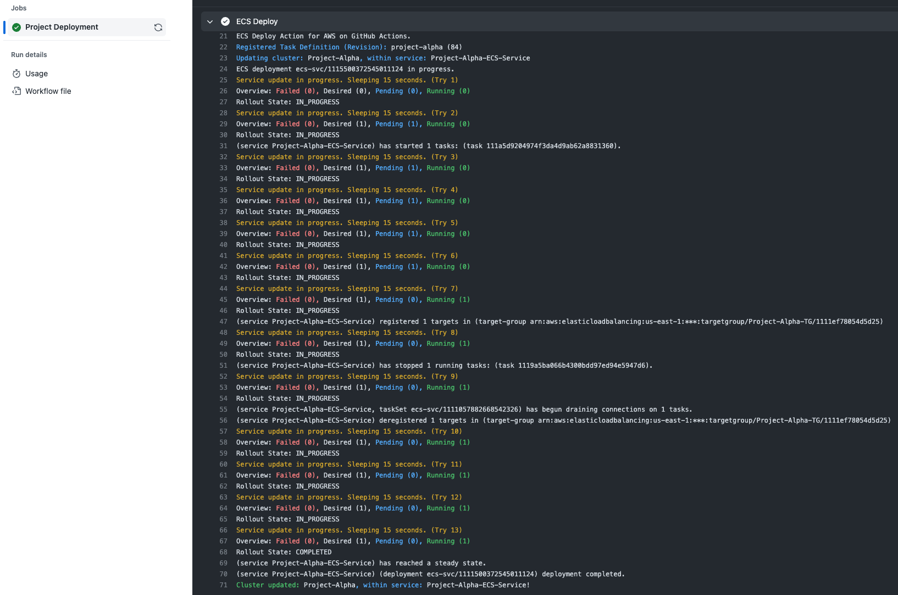

# AWS ECS Deploy Action
_To automatically edit task definitions via jq to then deploy & monitor. [Looking for CodeDeploy?](https://github.com/sourcetoad/aws-codedeploy-action)_



### How it works

 * Optionally, the action downloads the latest task definition from the given prepare task name (`ecs_prepare_task_definition_name`).
   * If fulfilled, it edits the task definition for each image change in `prepare_container_image_changes`
   * The task is executed one-off and requires successful completion before next step.
     * (this may require setting `prepare_container_network_config_filepath` to a JSON file representing the network configuration)
 * Afterwards, the action downloads the latest task definition from given main task parameter (`service_task_definition_name`).
 * Task definition is edited for each image change listed in `container_image_changes`.
 * Service update (with forced deployment) is triggered with that modified task definition file under the named service: `ecs_service_name`.
 * Status updates are provided as the deployment continues until either a successful or failure state is encountered.

### Assumptions

This is used in many applications for production level deployments. However, there are a few things that are untested as we do not use them.
 
 * Non-FARGATE deployments
 * CodeDeploy within ECS

---

## Usage
_includes examples from other packages to give context_

```yaml
- name: Configure AWS Credentials
  uses: aws-actions/configure-aws-credentials@v1
  with:
    role-to-assume: arn:aws:iam::123456789100:role/my-github-actions-role
    aws-region: us-east-1

- name: Login to Amazon ECR
  uses: aws-actions/amazon-ecr-login@v1

- name: "Build, tag, push image: ..."
  uses: docker/build-push-action@v4
  with:
    push: true

- name: ECS Deploy
  uses: sourcetoad/aws-ecs-deploy-action@v1
  with:
    ecs_service_name: project
    service_task_definition_name: project-alpha
    prepare_task_definition_name: project-alpha-migrations
    prepare_task_container_network_config_filepath: ".github/networks/alpha.json"
    prepare_task_container_image_changes: php|123456789100.dkr.ecr.us-east-1.amazonaws.com/php:version
    container_image_changes: >
        nginx|123456789100.dkr.ecr.us-east-1.amazonaws.com/nginx:version
        php|123456789100.dkr.ecr.us-east-1.amazonaws.com/php:version
```

## Customizing

### inputs

Following inputs can be used as `step.with` keys

| Name                                             | Required | Type   | Description                                                        |
|--------------------------------------------------|----------|--------|--------------------------------------------------------------------|
| `ecs_cluster_name`                               | yes      | string | ECS Cluster Name                                                   |
| `aws_region`                                     | no       | string | AWS Region (default: `us-east-1`)                                  |
| `ecs_service_name`                               | yes      | string | ECS Service Name                                                   |
| `ecs_launch_type`                                | no       | string | ECS Launch Type for tasks. (default: `FARGATE`)                    |
| `service_task_definition_name`                   | yes      | string | ECS Task Definition Name                                           |
| `service_container_image_changes`                | yes      | string | space delimited keypairs (`container(pipe)image`)                  |
| `prepare_task_definition_name`                   | no       | string | ECS Task Definition Name (Runs prior to execution)                 |
| `prepare_task_container_image_changes`           | no       | string | space delimited keypairs for prepare step (`container(pipe)image`) |
 | `prepare_task_container_network_config_filepath` | no       | string | filepath from context of root to json configuration                |
| `max_polling_iterations`                         | no       | Number | Number of 15s iterations to poll max (default: `60`)               |
| `dry_run`                                        | no       | bool   | Whether to skip write related AWS commands.                        |

## Skip waiting during update
Some projects may not want to poll till completion. Setting `max_polling_iterations` to `0` will exit the script cleanly
after the service update was triggered. Progress will have to be monitored elsewhere.

## Prepare Task
Some projects may require a task to complete prior to the rollout of the main system. This is commonly for migrations in Laravel projects.
These set of configurations allow when set require the task to execute and continue to completion prior to the main services updating.

* `prepare_task_definition_name` - The task name for the prepare task.
* `prepare_task_container_image_changes` - Image changes, much like explained below for container images
* `prepare_task_container_network_config_filepath` - JSON file for network configuration (example below)
```json
{
  "awsvpcConfiguration": {
    "subnets": ["string", "string2"],
    "securityGroups": ["string", "string2"],
    "assignPublicIp": "ENABLED|DISABLED"
  }
}
```

## Container Image Changes

When wishing to change multiple images in one task definition, leverage the formatting of Folded Style parameters.

Given this example:
```yaml
- uses: sourcetoad/aws-ecs-deploy-action@v1
  with:
    container_image_changes: >
        nginx|123456789100.dkr.ecr.us-east-1.amazonaws.com/nginx:version
        php|123456789100.dkr.ecr.us-east-1.amazonaws.com/php:version
```
 * This will crawl the `containerDefinitions` of the task definition
 * Finding the first container that has name `nginx`
   * Adapting the `image` property to `123456789100.dkr.ecr.us-east-1.amazonaws.com/nginx:version`
 * Finding the next container that has name `php`
   * Adapting the `image` property to `123456789100.dkr.ecr.us-east-1.amazonaws.com/php:version`

## IAM Policies
_An example hardened policy for the Role to assume with explanations._

```json5
{
    "Version": "2012-10-17",
    "Statement": [
        // Allows Actions to Register/View Task Definitions.
        {
            "Effect": "Allow",
            "Action": [
                "ecs:DescribeTaskDefinition",
                "ecs:RegisterTaskDefinition"
            ],
            // Not possible to harden to a specific resource
            "Resource": "*"
        },
        // [Optional] Allows Action to schedule one-off tasks via "prepare"
        {
            "Effect": "Allow",
            "Action": [
                "ecs:RunTask"
            ],
            "Condition": {
                "ArnEquals": {
                    "ecs:cluster": "arn:aws:ecs:{region}:{accountId}:cluster/{clusterName}"
                }
            },
            // Hardening must occur via `ArnEquals` condition above.
            "Resource": "*"
        },
        // [Optional] Allows Action to monitor the one-off task.
        {
            "Effect": "Allow",
            "Action": [
                "ecs:DescribeTasks"
            ],
            "Resource": "arn:aws:ecs:{region}:{accountId}:task/{clusterName}/*"
        },
        // Allows Action to trigger a service update with new task definition
        {
            "Effect": "Allow",
            "Action": [
                "ecs:UpdateService",
                "ecs:DescribeServices"
            ],
            "Resource": "arn:aws:ecs:{region}:{accountId}:service/{clusterName}/*"
        },
        // Allows Action to create new Task Definitions with the roles included in the Task Definition
        {
            "Effect": "Allow",
            "Action": [
                "iam:PassRole"
            ],
            // In order to create a Task Definition w/ Roles. You must have permission to Pass those roles.
            "Resource": [
                "arn:aws:iam::{accountId}:role/{roleName}",
                "arn:aws:iam::{accountId}:role/{roleName}"
            ]
        },
      // Allows Action to upload/verify ECR images via Docker Buildx
      {
        "Effect": "Allow",
        "Action": [
          "ecr:CompleteLayerUpload",
          "ecr:UploadLayerPart",
          "ecr:InitiateLayerUpload",
          "ecr:BatchCheckLayerAvailability",
          "ecr:PutImage",
          "ecr:BatchGetImage"
        ],
        "Resource": [
          "arn:aws:ecr:{region}:{accountId}:repository/{repositoryName}",
          "arn:aws:ecr:{region}:{accountId}:repository/{repositoryName}",
          "arn:aws:ecr:{region}:{accountId}:repository/{repositoryName}"
        ]
      },
      // Allows Action to authenticate via scoped permission set above against ECR Registry
      {
        "Effect": "Allow",
        "Action": "ecr:GetAuthorizationToken",
        // Not possible to harden gaining an ECR Auth token
        "Resource": "*"
      }
    ]
}
```
